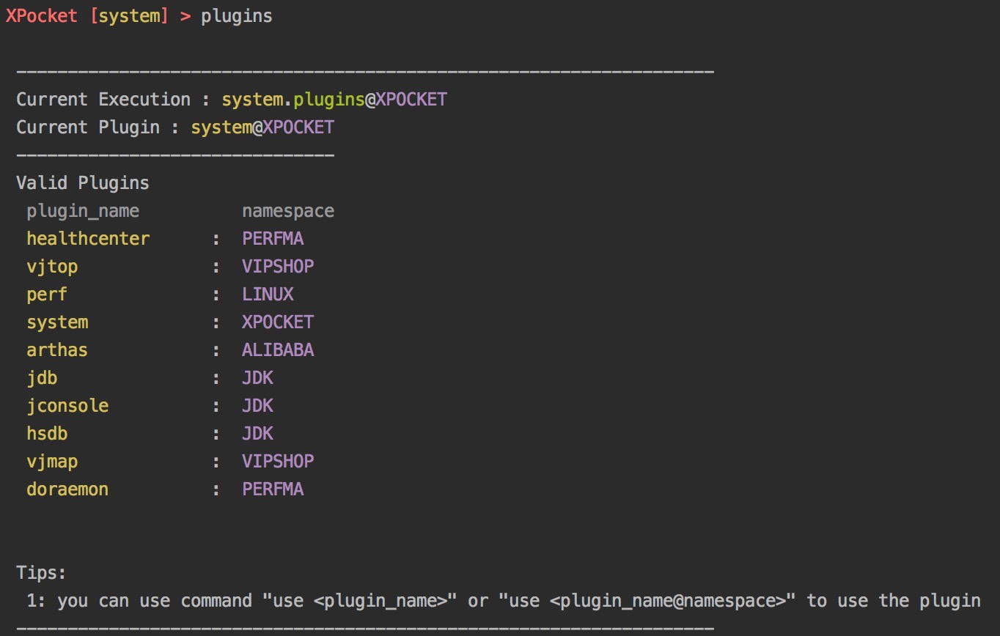

1.使用命令`system.plugins`{{execute}} 来查看插件列表，如下图所示。

2.使用命令 use + pluginName 来使用插件，如`use arthas@ALIBABA`

3.使用命令attach + pid的方式attach一个进程，方便使用arthas的主要功能，如trace;monitor;dashboard;thread;jad等，arthas的具体使用方式请阅读[arthas官方文档](https://arthas.aliyun.com/zh-cn/)。